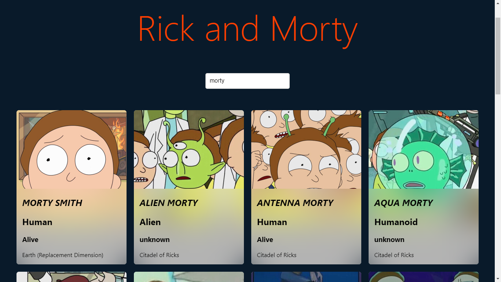

# Svelte Started
Foxes, Random Phrases and Rick and Morty API.



---

## Svelte app

To create a new project based on this template using [degit](https://github.com/Rich-Harris/degit):

```bash
npx degit sveltejs/template svelte-app
cd svelte-app
```

*Note that you will need to have [Node.js](https://nodejs.org) installed.*